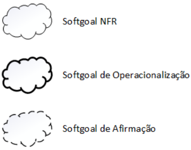

## Introdução
Diferente dos requisitos funcionais, que dizem o que o sistema deve fazer, os **requisitos não funcionais (RNF)** explicam como o sistema deve se comportar em certas situações.

Como esses requisitos costumam ser mais complexos e subjetivos, o NFR Framework ajuda a organizá-los de forma clara e estruturada. Ele permite representar, analisar e decidir sobre os RNFs usando **softgoals**, que são objetivos sem critérios de satisfação totalmente definidos.
Neste trabalho, o NFR Framework foi usado para representar os Requisitos Não Funcionais, mostrando suas relações e possíveis conflitos por meio de um gráfico de interdependência de softgoals (SIG).

## Integrantes do Grupo
A Tabela 1 apresenta todos os integrantes da equipe que participaram da etapa de NFR, juntamente com a descrição das atividades que cada um desenvolveu durante o projeto.

<strong>Tabela 1: Integrantes do Grupo Envolvidos</strong>

| Nome | Quais etapas participou |
|---------------------------|---------------------------------------|
| [Arthur Guilherme](https://github.com/ArthurGuilher62) |   |
| [Arthur Henrique](https://github.com/arthurhvieira1) |   |
| [Felipe Guimaraes](https://github.com/felipegf1) |   |
| [João Felipe](https://github.com/MrBolt2005) |   |
| [João Sapiência](https://github.com/JoaoSapiencia) |   |
| [Tiago Lemes](https://github.com/TiagoTeixeira-2005) | Criação da documentação e auxílio na criação do NFR 01 - Usabilidade |
| [Vilmar José](https://github.com/VilmarFagundes) |   |

<strong>Autoria de <a href="https://github.com/TiagoTeixeira-2005">Tiago Lemes</a></strong>

## Gráfico de Interdependência de Softgoals (SIG)
O Gráfico de Interdependência de Softgoals **(Softgoal Interdependency Graph — SIG)** é uma ferramenta do NFR Framework usada para mostrar de forma visual os **Requisitos Não Funcionais (NFR)** e como eles se relacionam entre si.

Esse gráfico apresenta, de maneira clara e resumida, as decisões de desenvolvimento, as alternativas consideradas e as justificativas de cada escolha. Sendo possível entender como diferentes softgoals se influenciam e verificar se os objetivos de nível mais alto foram alcançados.

### Tipos de Softgoals
Os softgoals no NFR Framework são divididos em três tipos principais:

- **Softgoals NFR:** representam os próprios Requisitos Não Funcionais, podendo ser organizados de forma hierárquica e relacionados entre si.

- **Softgoals de Operacionalização:** indicam as soluções práticas ou técnicas usadas para atender aos softgoals NFR, como processos, estruturas de dados ou restrições do sistema.

- **Softgoals de Afirmação:** descrevem características do domínio, como prioridades, carga de trabalho e critérios de decisão, ajudando a justificar escolhas e a rastrear as decisões tomadas durante o desenvolvimento.

<strong>Figura 1: Tipos de Softgoals</strong>

<strong>Fonte: </strong>

## Contribuições no NFR Framework

No **NFR Framework**, existem diferentes tipos de **contribuições** que mostram como a satisfação (ou não) de um softgoal descendente influencia a satisfação do *softgoal* ascendente.  
A seguir, são apresentados os principais tipos de contribuição definidos por **Chung et al. (2000)**:

- **AND:** todos os *softgoals* descendentes precisam ser satisfeitos para que o *softgoal* ascendente também seja satisfeito.  
- **OR:** basta que um dos *softgoals* descendentes seja satisfeito para que o *softgoal* ascendente também seja satisfeito.  
- **MAKE (++)**: contribuição totalmente positiva — se o descendente for satisfeito, o ascendente também será satisfeito no nível máximo.  
- **BREAK (--)**: contribuição totalmente negativa — se o descendente for satisfeito, o ascendente será negado.  
- **HELP (+)**: contribuição parcialmente positiva — se o descendente for parcialmente satisfeito, o ascendente também será parcialmente satisfeito.  
- **HURT (-)**: contribuição parcialmente negativa — se o descendente for satisfeito, o ascendente será parcialmente negado.  
- **UNKNOWN (?)**: contribuição desconhecida, podendo ser positiva ou negativa, dependendo do contexto.  
- **EQUALS:** o descendente só será satisfeito se o ascendente for satisfeito; da mesma forma, será negado se o ascendente for negado.  
- **SOME:** usada quando se conhece o tipo da contribuição (positiva ou negativa), mas não sua intensidade (parcial ou total).  
- **SOME+:** indica certeza de que a contribuição é positiva, mas incerteza quanto ao grau.  
- **SOME-:** indica certeza de que a contribuição é negativa, mas incerteza quanto ao grau.  

## Metodologia

## Gráfico de Interdependência de Softgoals (SIG)
A Figura 3 apresenta o Gráfico de Interdependência de Softgoals (SIG) dos Requisitos Não Funcionais do projeto.
Esse gráfico mostra como os softgoals se relacionam entre si e de que forma cada requisito contribui para atingir os objetivos gerais do sistema.

<strong>Figura 3: Gráfico de Interdependência de Softgoals (SIG) - Requisitos Não-Funcionais</strong>

<strong>Autoria de <a href="https://github.com/TiagoTeixeira-2005">Tiago Lemes</a></strong>

### NFR 01 - Usabilidade

<strong>Figura 4: Gráfico de Interdependência de Softgoals (SIG) - Usabilidade</strong>

    <strong>
        Autoria de 
        <a href="https://github.com/felipegf1">Felipe Guimaraes</a>,
        <a href="https://github.com/MrBolt2005">João Felipe</a>,
        <a href="https://github.com/JoaoSapiencia">João Sapiência</a> e
        <a href="https://github.com/TiagoTeixeira-2005">Tiago Lemes</a> 
    </strong>

### NFR 02 - Confiabilidade

### NFR 03 - Suportabilidade

### NFR 04 - Performance

## Gravação da validação do documento

## Agradecimentos
O Grupo 03 agradece o apoio das ferramentas de Inteligência Artificial Generativa — **ChatGPT, Google Gemini e DeepSeek** — na revisão gramatical e de estilo deste artigo. As tecnologias foram utilizadas para tornar o texto mais claro, objetivo e fácil de ler. Todo o conteúdo, assim como a precisão técnica e as ideias apresentadas, permanecem de responsabilidade dos autores.

## Referências

## Históricos de versão

| Versão | Data       | Descrição                                   | Autor(es)                                                   | Revisor       |
|--------|------------|---------------------------------------------|------------------------------------------------------------|---------------|
| 1.0    | 16/10/2025 | Criação do documento de NFR           | [Tiago Lemes](https://github.com/TiagoTeixeira-2005)       | [Vilmar José](https://github.com/VilmarFagundes) |

