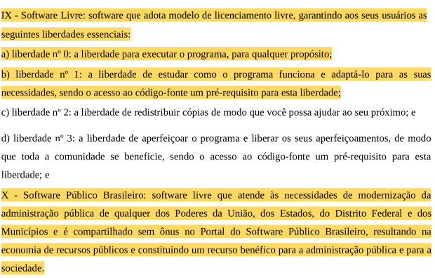

## Introdução

No início do projeto, foram avaliados diversos aplicativos com o objetivo de identificar suas funcionalidades, limitações, formas de aplicação dos conteúdos aprendidos em sala de aula e possíveis impactos em nossa vida cotidiana. Entre os sistemas analisados pelos integrantes do grupo estavam: *Jornada do Estudante*, *Uber*, *Guardiões da Saúde*, *Mercado Livre*, *SAE (Sistema de Apoio Educacional)* e *Caixa Lotérica*.

Após essa avaliação preliminar, o **SAE (Sistema de Apoio Educacional)** foi selecionado como foco do projeto, por apresentar relevância no contexto da educação pública, complexidade adequada para análise, originalidade em relação a trabalhos anteriores e a possibilidade de acesso a usuários para entrevistas.  

Os critérios que fundamentaram a escolha do SAE serão detalhados no próximo tópico.

## Critério de Escolha

A escolha do **SAE (Sistema de Apoio Educacional)** foi guiada por quatro critérios principais:

- **Relevância**: trata-se de uma plataforma aplicada diretamente ao contexto de serviços públicos de educação, alinhando-se ao objetivo da disciplina.  
- **Complexidade adequada**: o SAE apresenta um nível intermediário de requisitos, garantindo desafios suficientes para análise sem comprometer a viabilidade do trabalho.  
- **Originalidade**: até então, o sistema não havia sido avaliado em trabalhos anteriores da matéria, assegurando ineditismo na proposta.  
- **Acesso a usuários**: já existem usuários do SAE disponíveis para entrevistas e coletas de informações, o que facilita a pesquisa e o levantamento de requisitos reais

Além desses pontos, o SAE foi aprovado tanto pelo professor da disciplina de Requisitos, **André Barros**, quanto pelo professor de **Sistemas de Banco de Dados 2**, **Vandor Rissoli**, que utiliza a plataforma em sua prática pedagógica. Dessa forma, a escolha do sistema se mostrou pertinente e estratégica, permitindo explorar sua integração de tecnologias educacionais com métodos de ensino inovadores.

## Termos de uso 
Para garantir que a análise fosse feita de maneira adequada, o grupo consultou a documentação oficial do SAE (Sistema de Apoio Educacional). O SAE é creditado como software público (Figura 1), o que significa que sua documentação segue diretrizes específicas que priorizam a transparência e o acesso aberto. Isso possibilita que qualquer pessoa consulte as informações e até colabore no desenvolvimento.

**Figura 1 – SAE como Software Público**
  
**Fonte: Aplicativo SAE**

Durante a pesquisa, também foi encontrada a [PORTARIA Nº 46, DE 28 DE SETEMBRO DE 2016](../imagens/PORTARIA_N__46__DE_28_DE_SETEMBRO_DE_2016-1.pdf), que trata sobre software público (Figura 2). Essa referência reforçou a segurança e a conformidade da análise realizada.

**Figura 2 – Portaria sobre Software Público**
  
**Fonte: [PORTARIA Nº 46, DE 28 DE SETEMBRO DE 2016](../imagens/PORTARIA_N__46__DE_28_DE_SETEMBRO_DE_2016-1.pdf)**

## Rich Picture
O Rich Picture é uma técnica visual usada para entender e comunicar sistemas de forma simples. Ele ajuda a mostrar usuários, processos, informações, limites e possíveis problemas. Por ser informal, facilita a troca de ideias entre os participantes e contribui para identificar requisitos e pontos críticos.

No nosso projeto, o grupo escolheu o SAE por ser um presente na vida acadêmica de muitos estudantes da FCTE. O Rich Picture foi elaborado no Canva, representando os atores, funcionalidades, principais ações e limites do sistema.

Veja o Rich Picture do nosso projeto na página [Rich Picture](../Rich-picture/richpicture.md). 

## Histórico de versões

| Data       | Versão | Descrição                                                        | Autor(es)                       | Revisor |
|------------|--------|------------------------------------------------------------------|---------------------------------|---------|
| 09/09/2025 | 1.0    | Criação do documento inicial                                     | [João Sapiência]((https://github.com/JoaoSapiencia)), [Tiago Lemes](https://github.com/TiagoTeixeira-2005)     | [Vilmar José](https://github.com/VilmarFagundes)
| 09/09/2025 | 1.1    | Adição dos critérios de escolha do SAE e inclusão do histórico   | [João Sapiência]((https://github.com/JoaoSapiencia)), [Tiago Lemes](https://github.com/TiagoTeixeira-2005)     | [Vilmar José](https://github.com/VilmarFagundes)
